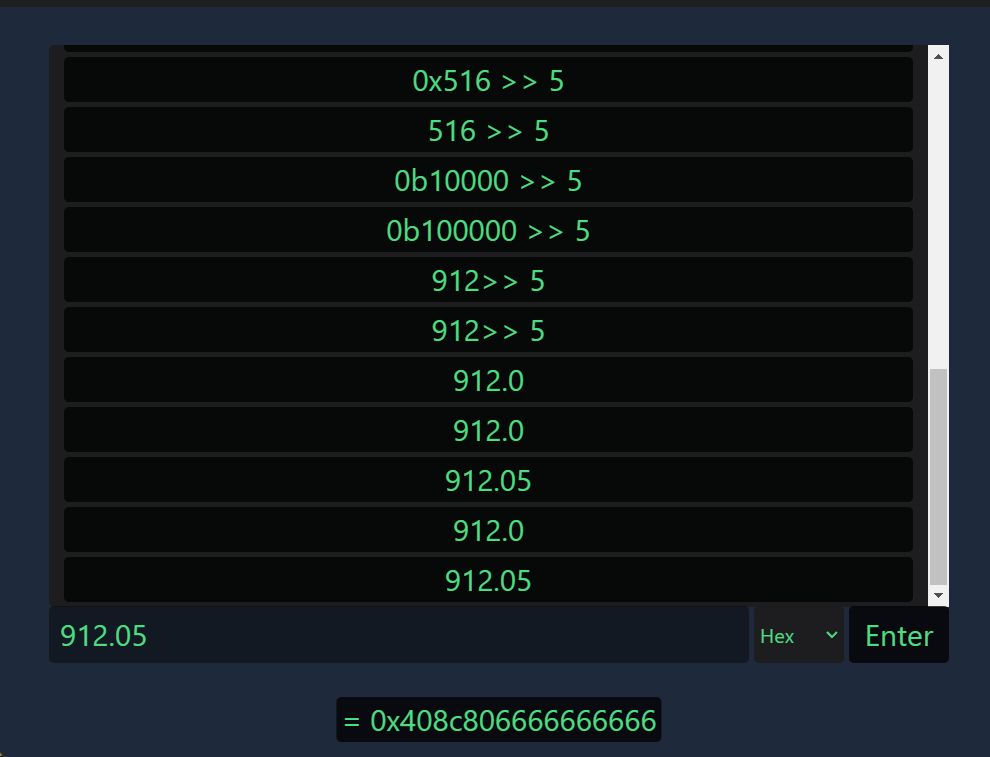
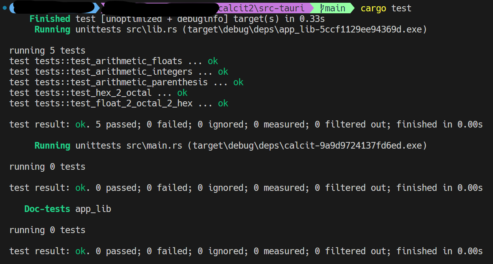

[](https://github.com/Qinbeans/CalcIt/actions/workflows/rust.yml)

# CalcIt

A **bit** more advanced calculator written in Rust.

Focused on being an easy to use calculator for programmers and engineers alike.



## Features

- [x] Basic arithmetic operations
- [x] Order of operations
  - [x] Parentheses
  - [x] And, Or, Xor
  - [x] Bit Shifts
  - [x] Multiplication, Division, Modulo
  - [x] Addition, Subtraction
- [x] Bitwise operation on Floats, Integers, Hexadecimals, Octals and Binaries
- [x] History of calculations
- [ ] Save history to file

## Precedence

So this bugged me for a bit and it took about 3 hours to research a feasible solution.

My solution was to create a new lexer that would parse a parenthesis enforced version of the input.  I knew my parethesis parser was working so I could use that to my advantage.

Based on: [Operator-precedence parser](https://en.wikipedia.org/wiki/Operator-precedence_parser#Precedence_climbing_method)


```
1.5 + 1 * 2.0
```

turns into:

```
((((((((1.5))))+((((1))*((2))))))))
```

The amount of padding is a bit excessive but it's a predictive method for how many levels of precedence there are.

My calculator now works with the following precedence:

```
1 - XOR
2 - OR and AND
3 - Bit Shifts(left and right)
4 - Plus and Minus
5 - Modulo
6 - Multiplication and Division
7 - Exponent and Root
```

The unary operators work at the same level as the numbers themselves.

## Building

All builds should be built with the latest version of Rust.  The tauri-cli version is 2.0.0-beta.9.

### Android

Make sure Java version 17 is installed.  You could go higher, but as of right now, 20 is not supported.

### IOS

Make sure XCode is installed.

## Testing



# *Chat.GPT Haiku*

    Qinbeans in the sun,
    CalcIt shines for all to see,
    Sharing knowledge free.